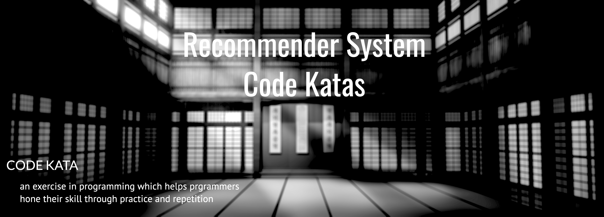

### Objective

Code Kata is defined as an **exercise** in programming which helps hone our skill through **practice and repetition**. In machine learning programming, Code Kata for implementing **ML algorithms** is very important, becuase we can realize the details ( such as Data Sampling, Weight initialization, various training strategy ...) while implementing the algorithm. 

I implement various algorithms using in **recommendation system** and organize them into scripts. I'll update one script each week.


> If you have a good topic, feel free to leave it on the issue! I will try to implement it as much as possible!


### How to do the Code Kada together? (set-up environment)

Do not worry! I provide the environment written as a [docker image](https://hub.docker.com/repository/docker/craftsangjae/jupyter-dojo).

````shell
# Run it From the root project directory
docker-compose up -d
````


### Rec-Sys Katas List


----

#### [Mining Frequent Pattern(apriori) using pandas](https://github.com/craftsangjae/recommender-system-dojo/blob/master/scripts/Mining%20Frequent%20Pattern(apriori)%20using%20Pandas.ipynb)

**Goals**

1. Implement Apriori function to extract frequent itemsets

2. Implement function to generate association rules from frequent itemsets

**Reference**

* [mlxtend](http://rasbt.github.io/mlxtend/user_guide/frequent_patterns/association_rules/)

---

#### [Thompson Sampling For A/B Test](https://github.com/craftsangjae/recommender-system-dojo/blob/master/scripts/Thompson%20Sampling%20Using%20AB%20test.ipynb)

**Goals**

* Implement Thompson Sampling Agent to find best choice for A/B Test.


----

#### [Real-Time Collaborative Filtering using MinHash](https://github.com/craftsangjae/recommender-system-dojo/blob/master/scripts/Realtime%20Collaborative%20Filtering%20using%20MinHash.ipynb)

**Goals**

* Implement Item-based CF Algorithm perfoming real-time recommendations and real-time Updates.
* two Ideas Included : (Below ideas were presented by YongHo-Ha)
  * Minhash as a LSH 
  * Secondary Indexing

**Reference** 

* [YongHo-Ha's Recommender System Design](https://www.slideshare.net/deview/261-52784785)


----

#### [Bayesian Personalized Ranking with Tensorflow](https://github.com/craftsangjae/recommender-system-dojo/blob/master/scripts/Bayesian%20Personalized%20Ranking%20with%20Tensorflow.ipynb)

**Goals**

* Implement BPR Algorithms (a kind of Matrix Factorization for implicit datasets)  using Tensorflow

**Reference** 

* [github - implicit](https://github.com/benfred/implicit)


----

#### [Serving Matrix Factorization using Annoy](https://github.com/craftsangjae/recommender-system-dojo/blob/master/scripts/Serving%20Matrix%20Factorization%20using%20Annoy.ipynb)

**Goals**

* perform item-based recommendation using approximate nearest neighbor search

**Reference**

* [github - annoy](https://github.com/spotify/annoy)


---

#### [Neural Collaborative Filtering With Tensorflow](https://github.com/craftsangjae/recommender-system-dojo/blob/master/scripts/Neural%20Collaborative%20Filtering%20with%20Tensorflow.ipynb)

**Goals**

* Implement NCF introduced in the [NCF Paper](https://arxiv.org/abs/1708.05031)

**Reference**

* [author's implementation](https://github.com/hexiangnan/neural_collaborative_filtering)


---

#### [DeepFM using Tensorflow](https://github.com/craftsangjae/recommender-system-dojo/blob/master/scripts/deepFM%20using%20Tensorflow.ipynb)

**Goals**

* Implement DeepFM introduced in the [DeepFM Paper](https://arxiv.org/pdf/1703.04247.pdf)

**Reference**

* [paper - DeepFM](https://arxiv.org/pdf/1703.04247.pdf)


----

##### CopyRight [![CC BY-SA 4.0][cc-by-sa-shield]][cc-by-sa]

This repository is licensed under a [Creative Commons Attribution-ShareAlike 4.0 International License][cc-by-sa].

[![CC BY-SA 4.0][cc-by-sa-image]][cc-by-sa]

[cc-by-sa]: http://creativecommons.org/licenses/by-sa/4.0/
[cc-by-sa-image]: https://licensebuttons.net/l/by-sa/4.0/88x31.png
[cc-by-sa-shield]: https://img.shields.io/badge/License-CC%20BY--SA%204.0-lightgrey.svg


